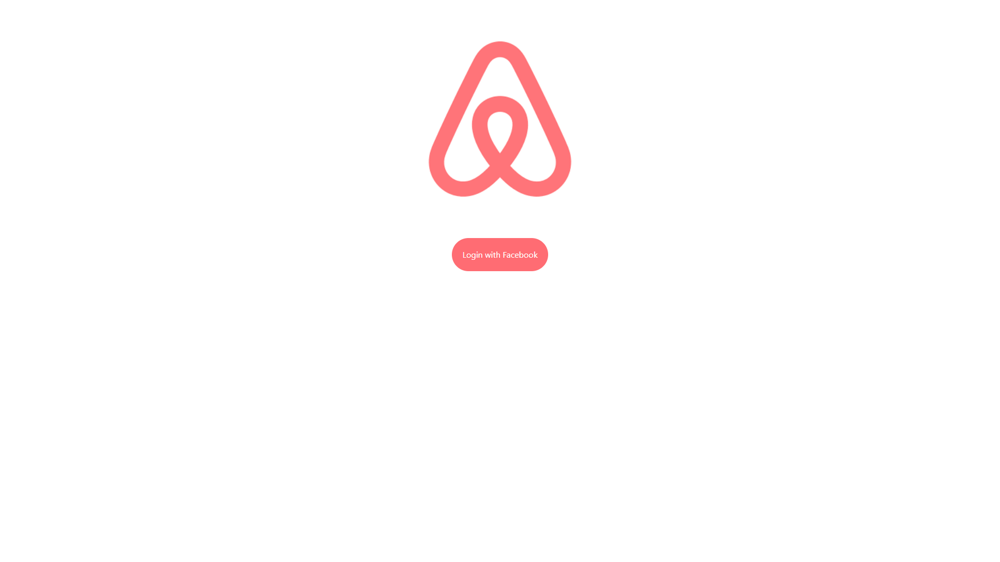
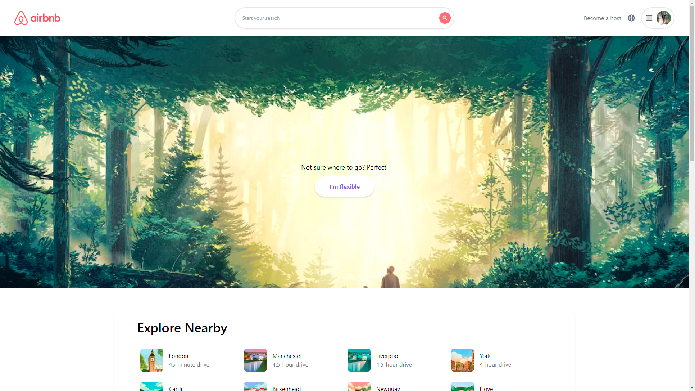
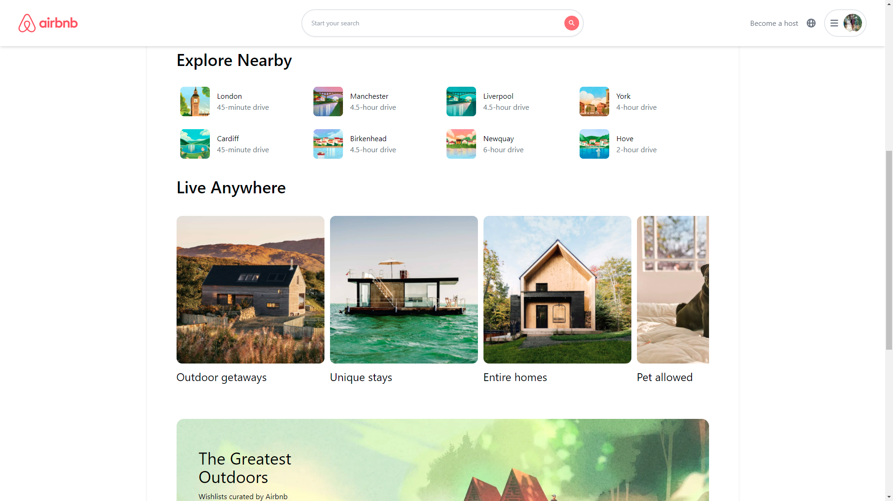
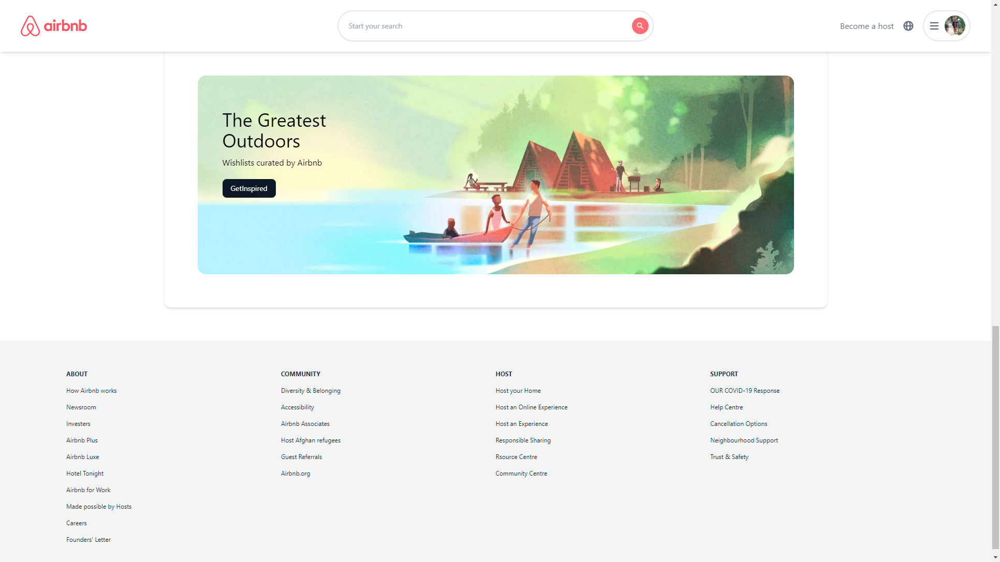
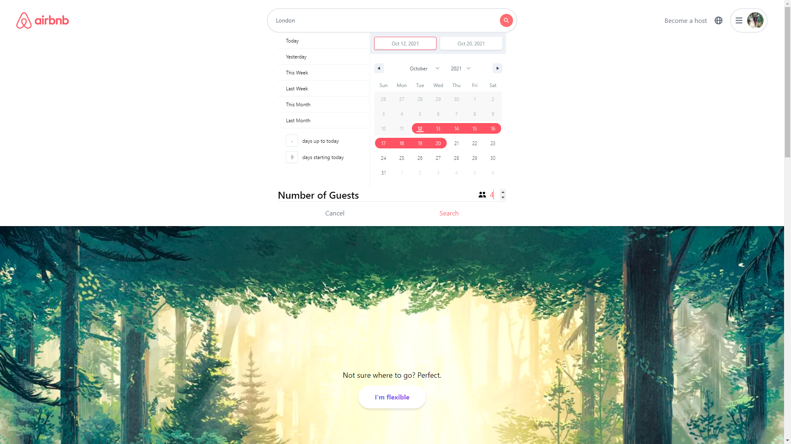
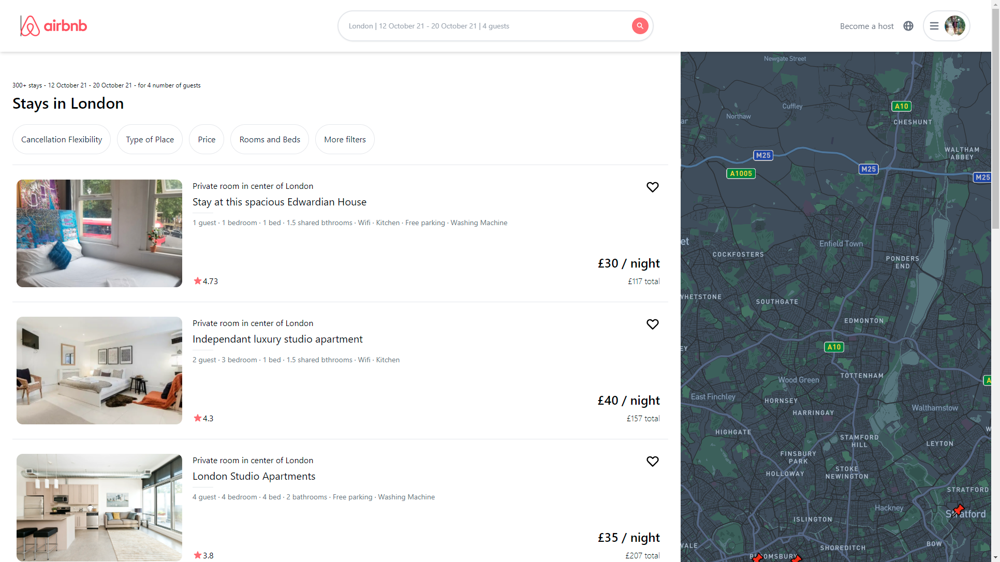
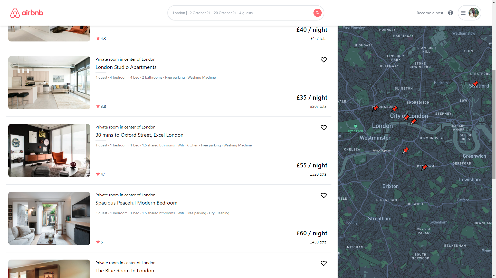
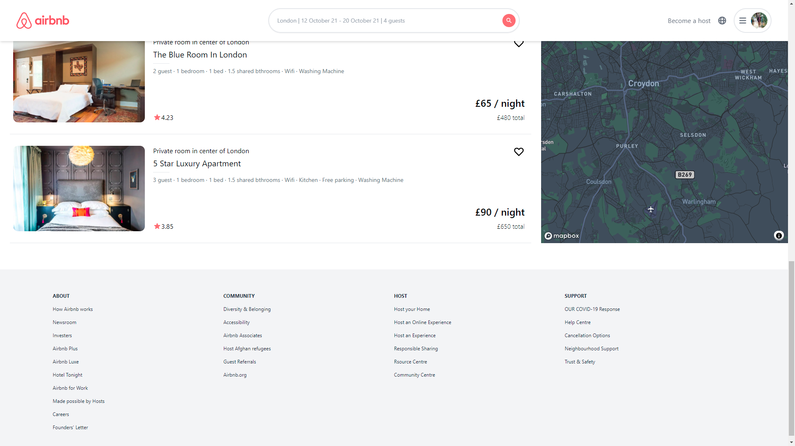

# Airbnb Clone using NEXT JS, Mapbox, with authentication using NextAuth.

This is an Airbnb clone that has been created using Next Js. There are also other features such as the Mapbox and authentication using NextAuth that hae also been implemented.

# Live version of the app: [here](https://airbnb-clone-subhadeep-das.vercel.app)

# Screenshots of the app:
<p><b>Login Page:-</b></p>



<p><b>Home Page(Top):-</b></p>



<p><b>Home Page(Middle):-</b></p>



<p><b>Home Page(Bottom):-</b></p>



<p><b>Home Page(Choice of stay):-</b></p>



<p><b>Search Results Page(Top):-</b></p>



<p><b>Search Results Page(Middle):-</b></p>



<p><b>Search Results Page(Bottom):-</b></p>



# Next.js + Tailwind CSS Example

This example shows how to use [Tailwind CSS](https://tailwindcss.com/) [(v2.2)](https://blog.tailwindcss.com/tailwindcss-2-2) with Next.js. It follows the steps outlined in the official [Tailwind docs](https://tailwindcss.com/docs/guides/nextjs).

It uses the new [`Just-in-Time Mode`](https://tailwindcss.com/docs/just-in-time-mode) for Tailwind CSS.

## Preview

Preview the example live on [StackBlitz](http://stackblitz.com/):

[](https://stackblitz.com/github/vercel/next.js/tree/canary/examples/with-tailwindcss)

## Deploy your own

Deploy the example using [Vercel](https://vercel.com?utm_source=github&utm_medium=readme&utm_campaign=next-example):

[](https://vercel.com/new/git/external?repository-url=https://github.com/vercel/next.js/tree/canary/examples/with-tailwindcss&project-name=with-tailwindcss&repository-name=with-tailwindcss)

## How to use

Execute [`create-next-app`](https://github.com/vercel/next.js/tree/canary/packages/create-next-app) with [npm](https://docs.npmjs.com/cli/init) or [Yarn](https://yarnpkg.com/lang/en/docs/cli/create/) to bootstrap the example:

```bash
npx create-next-app --example with-tailwindcss with-tailwindcss-app
# or
yarn create next-app --example with-tailwindcss with-tailwindcss-app
```

Deploy it to the cloud with [Vercel](https://vercel.com/new?utm_source=github&utm_medium=readme&utm_campaign=next-example) ([Documentation](https://nextjs.org/docs/deployment)).
